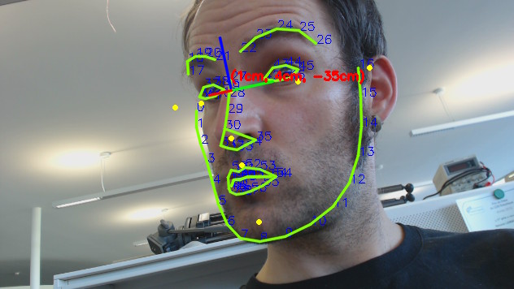

gazr
====



*gazr* is a library and a set of tools for real-time gaze estimation from a
monocular camera (typically, a webcam).

Currently, it only performs 6D head pose estimation. Eye orientation based on
pupil tracking is being worked on.

If you plan to use this library for academic purposes, we kindly request you to
[cite our work](CITATION).

Head pose estimation
--------------------

This library (`libhead_pose_estimation.so`) performs 3D head pose estimation
based on the fantastic [dlib](http://dlib.net/) face detector and a bit of
[OpenCV's
solvePnP](http://docs.opencv.org/modules/calib3d/doc/camera_calibration_and_3d_reconstruction.html#solvepnp) magic (it uses [adult male anthropometric](https://github.com/chili-epfl/attention-tracker/blob/5dcef870c96892d80ca17959528efba0b2d0ce1c/src/head_pose_estimation.hpp#L12) data to match a real 3D head to the projected image).

The library returns a 4x4 transformation matrix.

It supports detection and tracking of multiple faces at the same time, and runs
on-line, but it *does not* feature face identification.

Installation
------------

**Note**: The library has only been tested on Linux. We can only provide limited
support for other operating systems!

### Pre-requisites

First, navigate from the root of this repository to the `gazr` directory to make the `build` directory:

```
cd ext/gazr
mkdir build
cd build
```

Next, download and install dlib:

```
wget dlib.net/files/dlib-19.4.zip
unzip dlib-19.4.zip
rm dlib-19.4.zip
cd dlib-19.4
mkdir build
cd build
cmake -DCMAKE_BUILD_TYPE=Release ..
cmake --build . --config Release
make
sudo make install
```

Then go back to the build directory for Gazr:

```
cd ../..
```

Install boost-python: 
```
brew install boost --with-python
brew install boost-python
```
We need to also copy some extra cmake files for dlib: 
```
sudo cp -r dlib-19.4/dlib/cmake_utils/test_for_cpp11/ /usr/local/include/dlib/cmake_utils/
sudo cp -r dlib-19.4/dlib/cmake_utils/test_for_cpp11/CMakeLists.txt /usr/local/include/dlib/cmake_utils/test_for_cpp11
sudo cp -r dlib-19.4/dlib/cmake_utils/test_for_cpp11/cpp11_test.cpp /usr/local/include/dlib/cmake_utils/test_for_cpp11
```

Finally, compile Gazr. *Note that we've updated the `cmake` command below to enable compiler optimizations*:

```
cmake -DCMAKE_BUILD_TYPE=Release ..
make
```
Run ``./gazr_show_head_pose --model ../share/shape_predictor_68_face_landmarks.dat`` to test
the library. You should get something very similar to the picture above.

Plotting the head pose
----------------------
From the build directory, run
```
./gazr_estimate_head_direction --model ../share/shape_predictor_68_face_landmarks.dat --show | python ../tools/live_plot.py
```

Echoing the head pose
----------------------
From the build directory, run
```
./gazr_estimate_head_direction --model ../share/shape_predictor_68_face_landmarks.dat --show | python ../tools/echo.py
```

You can also run ``./gazr_show_head_pose --model ../share/shape_predictor_68_face_landmarks.dat`` to test
the library. You should get something similar to the picture above.
